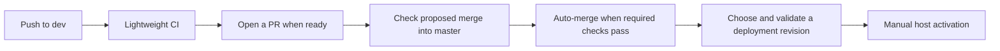

# CI and promotion to master

Develop on `dev` and push normally. Every push runs the lightweight `Checks`
workflow. When a batch is ready, open a pull request from `dev` to `master` and
enable auto-merge with a merge commit. GitHub merges it after the required
`CI passed` check succeeds and branch protection requirements are satisfied.
Opening the pull request is the decision to promote that batch.



## Required checks

The workflow runs on pushes to `dev` and `master`, pull requests targeting either
branch, and manual dispatch. PR checkout uses GitHub's proposed merge revision.
Branch and PR runs remain separate because they validate different revisions.
New pushes cancel outdated runs for the same branch or pull request.

| Job | Required evidence |
| --- | --- |
| Formatting and lint | Alejandra, Ruff format, shfmt, Ruff lint, Bash syntax, ShellCheck and actionlint |
| Python and generated documentation | Execute the packaged Python suite and reject service-reference or test-catalogue drift |
| Nix evaluation | Evaluate isolated base, ARR/Radarr, media/Jellyfin and host-template configurations; evaluate CLI/setup derivations and any repository hosts |
| CI passed | Succeed only when every preceding job succeeded; failed, skipped or cancelled dependencies cannot pass this gate |

Target about ten minutes of execution on GitHub-hosted runners, excluding queue
time. Each working job has a fifteen-minute timeout; the final status job has
two minutes. Jobs run in parallel on separate runners. Nix work is limited to
two concurrent builds with two cores each. Routine checks do not need KVM.
Each job reports filesystem usage so cold-run time and remaining disk space can
be assessed in Actions before expanding the required scope.

The Python check provides its Redis, SQLite, SOPS and age dependencies and runs
the tests rather than dry-running their derivation. Configuration checks force
NixOS assertions through `system.build.toplevel.drvPath` without building or
activating those systems. Import-from-derivation is disabled in automatic CI.
Small report and tooling derivations are built as needed. The minimal `ci`
development shell avoids downloading the full interactive development tools.

The full `public-module-api` check, all-service configuration matrix, ARM
configuration checks, VM startup/recovery tests and full system builds are
outside this gate. Run relevant heavy checks locally on a suitable builder or
through the manually dispatched `Heavy Checks` workflow. Its GitHub-hosted
runners still have time and disk limits; manual dispatch does not remove them.
See [validation commands](validation.md) and the [support matrix](support-matrix.md).
A passing `CI passed` status establishes this lightweight scope, not service
runtime or upgrade validation. Actual GitHub timings remain to be measured;
local results do not establish a passing remote run.

## Configure GitHub once

Workflow YAML cannot enable repository auto-merge or protect `master`. A
repository administrator must apply these settings separately:

1. Push this workflow to `dev` and let `Checks` complete successfully so GitHub
   knows the `CI passed` status name.
2. In **Settings > General > Pull Requests**, enable **Allow merge commits** and
   **Allow auto-merge**. Preserve the long-lived `dev` branch by leaving automatic
   head-branch deletion disabled.
3. In **Settings > Branches**, add or update the branch protection rule for `master`:
   - Require a pull request before merging.
   - Require status checks, selecting **CI passed** from GitHub Actions. Replace
     the old **Formatting, ShellCheck and Nix evaluation** requirement if present.
   - Require the branch to be up to date before merging.
   - Apply the rule to administrators too (do not allow bypassing).
   - Keep force pushes and branch deletion disabled.
   - Leave required approving reviews disabled for a solo maintainer; the PR
     remains the deliberate promotion step.
   - Leave linear-history and merge-queue requirements disabled for this flow.
4. Open the initial `dev` to `master` PR and enable **Auto-merge > Create a merge
   commit**. If all requirements already pass, GitHub offers an immediate merge.
   Complete that PR through the same protected merge requirements.

See GitHub's documentation for [branch protection](https://docs.github.com/en/repositories/configuring-branches-and-merges-in-your-repository/managing-protected-branches/about-protected-branches)
and [auto-merge](https://docs.github.com/en/pull-requests/how-tos/merge-and-close-pull-requests/automatically-merging-a-pull-request).
The workflow needs only a read-only repository token; it does not push branches
or merge PRs using an administrative token.

## Normal development cycle

Push work to `dev` for feedback. When the batch is complete, open a new PR with
base `master` and head `dev`, review its diff, and enable auto-merge. Correct any
failed checks by pushing fixes to `dev`; each push refreshes the PR and its
checks. Further `dev` pushes become part of that open PR, so disable auto-merge
or use a temporary feature branch before starting unrelated unfinished work.

Use merge commits for these promotions. Squashing a repeatedly reused branch
can make later PRs include commits that were already promoted. GitHub describes
this in its [merge-method guidance](https://docs.github.com/en/pull-requests/reference/pull-request-merges).

After a merge, bring `master` back into `dev` before the next promotion. With a
clean working tree:

```sh
git fetch origin
git switch dev
git merge --ff-only origin/dev
git merge origin/master
git push origin dev
```

This normally fast-forwards when development has not continued. If `dev` has
advanced or `master` received another PR, resolve the merge normally and push
the result so CI checks it. Do not force-push shared branch history.

Deployment is manual. Select a merged revision, run the checks appropriate to
the affected host and services, and follow the [operations guide](operations.md).
These workflows neither activate hosts nor publish releases automatically.
